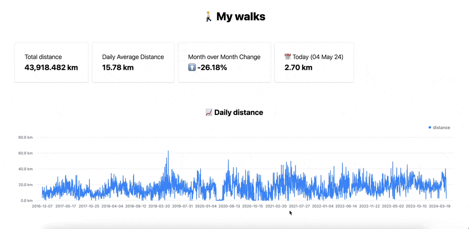
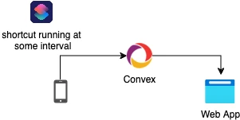

## What
This repo contains the code I used to export my walking distance data from an iOS device and feed it to a custom-built system with a live dashboard and some nice visualizations. 



## Why
I find the health dashboard on iOS to be annoyingly limited and I've been thinking about building something more useful for a while now. I've been eyeing Convex for some time as well, so this felt like a nice opportunity to take it for a spin. 

## How

The setup is fairly simple.

1. An automated shortcut sends data to a Convex http endpoint
2. Whenever it receives new data, Convex processes it and writes it to a table
3. The table is hooked up to a React app that is automatically updated



First, export the data from the Health App of your iOS device. The export should look something like this:
```
├── export.xml
└── export_cda.xml
```
*export.xml* includes all the health data your device has collected up to this point. For my purposes, I am only interested in walking/running distance, but other metrics can easily be parsed by extending [parse.py](seed/parse.py)

To get the time series data (grouped by day), run:

```
python parse.py --path=<path-to-export.xml>
```

Install and start the web app:
```
cd app
npm install
npx convex dev # this will prompt you to set up convex
npm run dev
``` 

Import the data into convex:
```
npx convex import --table data <path-to-data.json>
```

To get live updates, you'll need an iOS shortcut that exports the data and sends it over to Convex.
Here's a link to the one I'm using: [https://www.icloud.com/shortcuts/b7be795b23f5455f8c955e976e052091](https://www.icloud.com/shortcuts/b7be795b23f5455f8c955e976e052091) - very far from optimal, but it gets the job done and I didn't want to spent too much time on that part.

> [!NOTE]  
> As of May 2024, iOS shortcut automations can only be set up to run daily, meaning that if you need something to run every X minutes, you need to create multiple automations.


> [!NOTE]  
> This setup is best suited for a hobby personal project as it uses full table scans to fetch the data. Consider tweaking the schema or  switching to a specialized time-series database if you need something more scalable.

Useful links:

- [iOS shortcuts](https://support.apple.com/guide/shortcuts/welcome/ios)
- [Convex](https://www.convex.dev/)
- [Tremor](https://www.tremor.so/)